# Credit Scoring Model

A production-ready credit risk assessment system using Weight of Evidence (WOE) transformation with Logistic Regression, enhanced by Bayesian hyperparameter optimization.

---

## Table of Contents

- [Overview](#overview)
- [Architecture](#architecture)
- [Pipeline Stages](#pipeline-stages)
- [Feature Engineering](#feature-engineering)
- [Model Training](#model-training)
- [Hyperparameter Optimization](#hyperparameter-optimization)
- [Evaluation Metrics](#evaluation-metrics)
- [Validation Strategy](#validation-strategy)
- [Output Artifacts](#output-artifacts)
- [Installation](#installation)
- [Usage](#usage)

---

## Overview

This project implements a complete credit scoring pipeline that predicts the probability of loan default. The system processes raw credit bureau data through multiple transformation stages and produces calibrated probability scores suitable for production deployment.

### Key Features

- **WOE-based feature transformation** for monotonic relationships
- **Multi-stage feature selection** using IV, Gini, and correlation analysis
- **Bayesian hyperparameter optimization** with Optuna
- **Probability calibration** using isotonic regression
- **Comprehensive model comparison** and evaluation

### Dataset Characteristics

| Metric | Value |
|--------|-------|
| Training Samples | 68,764 |
| Validation Samples | 17,191 |
| Test Samples | 10,734 |
| Original Features | 2,738 |
| Final Features | 238 |
| Target Rate | 1.91% |
| Target Variable | Binary (0=Good, 1=Default) |

---

## Architecture

### High-Level System Architecture

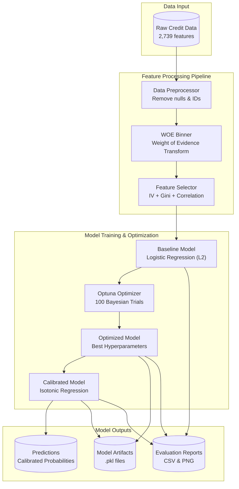
```mermaid
flowchart TB
    subgraph Input["Data Input"]
        A[("Raw Credit Data<br/>2,739 features")]
    end

    subgraph Processing["Feature Processing Pipeline"]
        B["Data Preprocessor<br/>Remove nulls & IDs"]
        C["WOE Binner<br/>Weight of Evidence Transform"]
        D["Feature Selector<br/>IV + Gini + Correlation"]
    end

    subgraph Modeling["Model Training & Optimization"]
        E["Baseline Model<br/>Logistic Regression (L2)"]
        F["Optuna Optimizer<br/>100 Bayesian Trials"]
        G["Optimized Model<br/>Best Hyperparameters"]
        H["Calibrated Model<br/>Isotonic Regression"]
    end

    subgraph Output["Model Outputs"]
        I[("Predictions<br/>Calibrated Probabilities")]
        J[("Model Artifacts<br/>.pkl files")]
        K[("Evaluation Reports<br/>CSV & PNG")]
    end

    A --> B
    B --> C
    C --> D
    D --> E
    E --> F
    F --> G
    G --> H
    H --> I
    G --> J
    H --> J
    E --> K
    G --> K
    H --> K
```

### Component Interaction Diagram

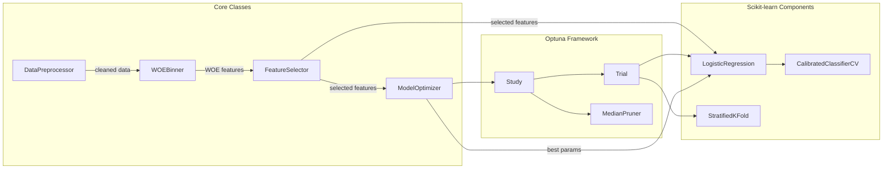
```mermaid
flowchart LR
    subgraph Classes["Core Classes"]
        DP["DataPreprocessor"]
        WB["WOEBinner"]
        FS["FeatureSelector"]
        MO["ModelOptimizer"]
    end

    subgraph sklearn["Scikit-learn Components"]
        LR["LogisticRegression"]
        SKF["StratifiedKFold"]
        CCV["CalibratedClassifierCV"]
    end

    subgraph optuna["Optuna Framework"]
        ST["Study"]
        TR["Trial"]
        PR["MedianPruner"]
    end

    DP -->|cleaned data| WB
    WB -->|WOE features| FS
    FS -->|selected features| LR
    FS -->|selected features| MO
    MO --> ST
    ST --> TR
    TR --> LR
    TR --> SKF
    ST --> PR
    MO -->|best params| LR
    LR --> CCV
```

---

## Pipeline Stages

### Complete Data Flow

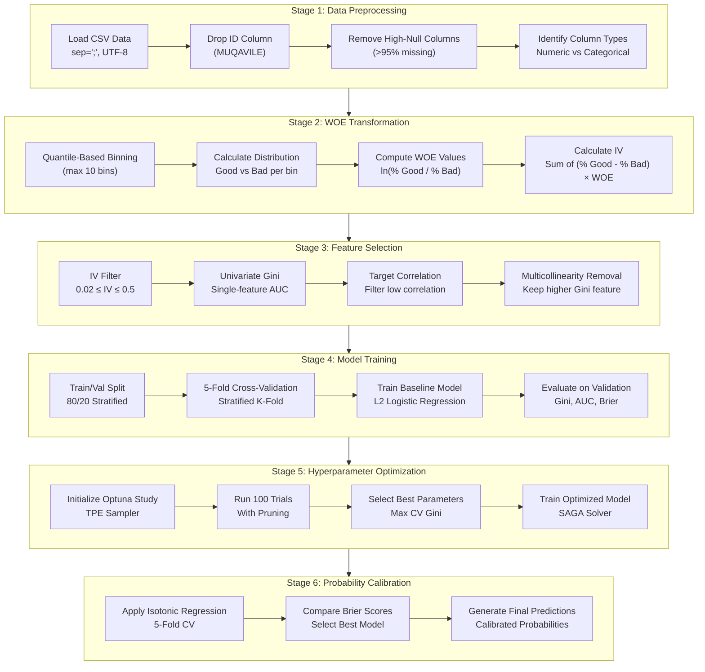
```mermaid
flowchart TD
    subgraph Stage1["Stage 1: Data Preprocessing"]
        A1["Load CSV Data<br/>sep=';', UTF-8"] --> A2["Drop ID Column<br/>(MUQAVILE)"]
        A2 --> A3["Remove High-Null Columns<br/>(>95% missing)"]
        A3 --> A4["Identify Column Types<br/>Numeric vs Categorical"]
    end

    subgraph Stage2["Stage 2: WOE Transformation"]
        B1["Quantile-Based Binning<br/>(max 10 bins)"] --> B2["Calculate Distribution<br/>Good vs Bad per bin"]
        B2 --> B3["Compute WOE Values<br/>ln(% Good / % Bad)"]
        B3 --> B4["Calculate IV<br/>Sum of (% Good - % Bad) × WOE"]
    end

    subgraph Stage3["Stage 3: Feature Selection"]
        C1["IV Filter<br/>0.02 ≤ IV ≤ 0.5"] --> C2["Univariate Gini<br/>Single-feature AUC"]
        C2 --> C3["Target Correlation<br/>Filter low correlation"]
        C3 --> C4["Multicollinearity Removal<br/>Keep higher Gini feature"]
    end

    subgraph Stage4["Stage 4: Model Training"]
        D1["Train/Val Split<br/>80/20 Stratified"] --> D2["5-Fold Cross-Validation<br/>Stratified K-Fold"]
        D2 --> D3["Train Baseline Model<br/>L2 Logistic Regression"]
        D3 --> D4["Evaluate on Validation<br/>Gini, AUC, Brier"]
    end

    subgraph Stage5["Stage 5: Hyperparameter Optimization"]
        E1["Initialize Optuna Study<br/>TPE Sampler"] --> E2["Run 100 Trials<br/>With Pruning"]
        E2 --> E3["Select Best Parameters<br/>Max CV Gini"]
        E3 --> E4["Train Optimized Model<br/>SAGA Solver"]
    end

    subgraph Stage6["Stage 6: Probability Calibration"]
        F1["Apply Isotonic Regression<br/>5-Fold CV"] --> F2["Compare Brier Scores<br/>Select Best Model"]
        F2 --> F3["Generate Final Predictions<br/>Calibrated Probabilities"]
    end

    Stage1 --> Stage2
    Stage2 --> Stage3
    Stage3 --> Stage4
    Stage4 --> Stage5
    Stage5 --> Stage6
```

### Feature Reduction Flow

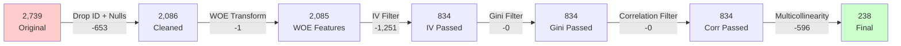
```mermaid
flowchart LR
    A["2,739<br/>Original"] -->|"Drop ID + Nulls<br/>-653"| B["2,086<br/>Cleaned"]
    B -->|"WOE Transform<br/>-1"| C["2,085<br/>WOE Features"]
    C -->|"IV Filter<br/>-1,251"| D["834<br/>IV Passed"]
    D -->|"Gini Filter<br/>-0"| E["834<br/>Gini Passed"]
    E -->|"Correlation Filter<br/>-0"| F["834<br/>Corr Passed"]
    F -->|"Multicollinearity<br/>-596"| G["238<br/>Final"]

    style A fill:#ffcccc
    style G fill:#ccffcc
```

---

## Feature Engineering

### Weight of Evidence (WOE) Transformation

WOE transforms categorical and continuous variables into a standardized scale that reflects their predictive power.

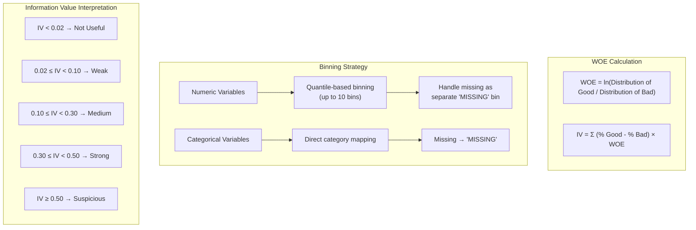
```mermaid
flowchart TD
    subgraph Formula["WOE Calculation"]
        F1["WOE = ln(Distribution of Good / Distribution of Bad)"]
        F2["IV = Σ (% Good - % Bad) × WOE"]
    end

    subgraph Binning["Binning Strategy"]
        B1["Numeric Variables"]
        B2["Quantile-based binning<br/>(up to 10 bins)"]
        B3["Handle missing as<br/>separate 'MISSING' bin"]

        B4["Categorical Variables"]
        B5["Direct category mapping"]
        B6["Missing → 'MISSING'"]

        B1 --> B2 --> B3
        B4 --> B5 --> B6
    end

    subgraph IVScale["Information Value Interpretation"]
        I1["IV < 0.02 → Not Useful"]
        I2["0.02 ≤ IV < 0.10 → Weak"]
        I3["0.10 ≤ IV < 0.30 → Medium"]
        I4["0.30 ≤ IV < 0.50 → Strong"]
        I5["IV ≥ 0.50 → Suspicious"]
    end
```

### Information Value Distribution

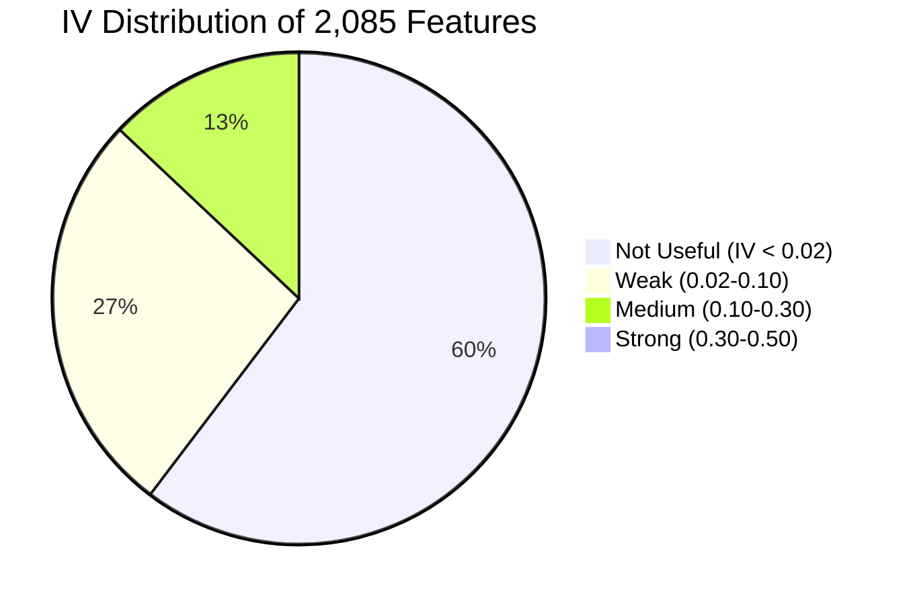
```mermaid
pie title IV Distribution of 2,085 Features
    "Not Useful (IV < 0.02)" : 1251
    "Weak (0.02-0.10)" : 554
    "Medium (0.10-0.30)" : 269
    "Strong (0.30-0.50)" : 11
```

### Feature Selection Pipeline

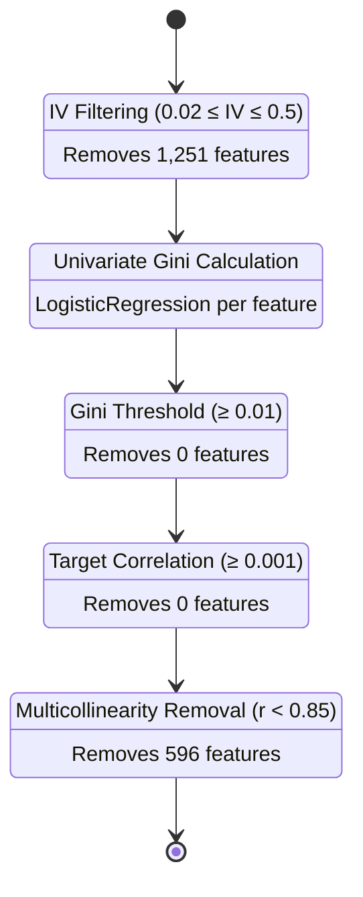
```mermaid
stateDiagram-v2
    [*] --> IVFilter
    IVFilter: IV Filtering (0.02 ≤ IV ≤ 0.5)
    IVFilter: Removes 1,251 features

    IVFilter --> GiniCalc
    GiniCalc: Univariate Gini Calculation
    GiniCalc: LogisticRegression per feature

    GiniCalc --> GiniFilter
    GiniFilter: Gini Threshold (≥ 0.01)
    GiniFilter: Removes 0 features

    GiniFilter --> CorrFilter
    CorrFilter: Target Correlation (≥ 0.001)
    CorrFilter: Removes 0 features

    CorrFilter --> MultiColl
    MultiColl: Multicollinearity Removal (r < 0.85)
    MultiColl: Removes 596 features

    MultiColl --> [*]
```

---

## Model Training

### Baseline Model Configuration

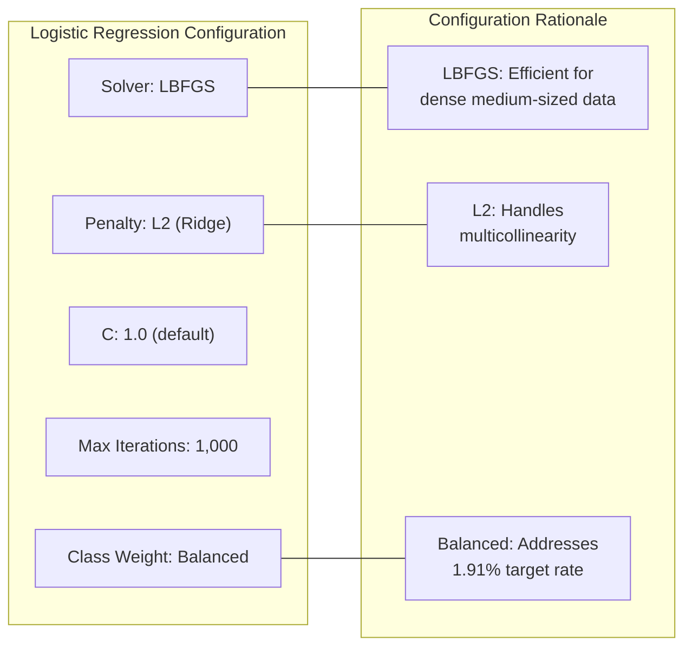
```mermaid
flowchart LR
    subgraph Config["Logistic Regression Configuration"]
        C1["Solver: LBFGS"]
        C2["Penalty: L2 (Ridge)"]
        C3["C: 1.0 (default)"]
        C4["Max Iterations: 1,000"]
        C5["Class Weight: Balanced"]
    end

    subgraph Purpose["Configuration Rationale"]
        P1["LBFGS: Efficient for<br/>dense medium-sized data"]
        P2["L2: Handles<br/>multicollinearity"]
        P3["Balanced: Addresses<br/>1.91% target rate"]
    end

    C1 --- P1
    C2 --- P2
    C5 --- P3
```

### Cross-Validation Strategy

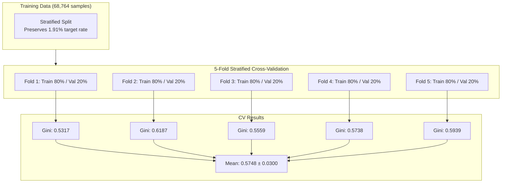
```mermaid
flowchart TD
    subgraph Data["Training Data (68,764 samples)"]
        D1["Stratified Split<br/>Preserves 1.91% target rate"]
    end

    subgraph CV["5-Fold Stratified Cross-Validation"]
        F1["Fold 1: Train 80% / Val 20%"]
        F2["Fold 2: Train 80% / Val 20%"]
        F3["Fold 3: Train 80% / Val 20%"]
        F4["Fold 4: Train 80% / Val 20%"]
        F5["Fold 5: Train 80% / Val 20%"]
    end

    subgraph Results["CV Results"]
        R1["Gini: 0.5317"]
        R2["Gini: 0.6187"]
        R3["Gini: 0.5559"]
        R4["Gini: 0.5738"]
        R5["Gini: 0.5939"]
        R6["Mean: 0.5748 ± 0.0300"]
    end

    Data --> CV
    F1 --> R1
    F2 --> R2
    F3 --> R3
    F4 --> R4
    F5 --> R5
    R1 & R2 & R3 & R4 & R5 --> R6
```

---

## Hyperparameter Optimization

### Bayesian Optimization with Optuna

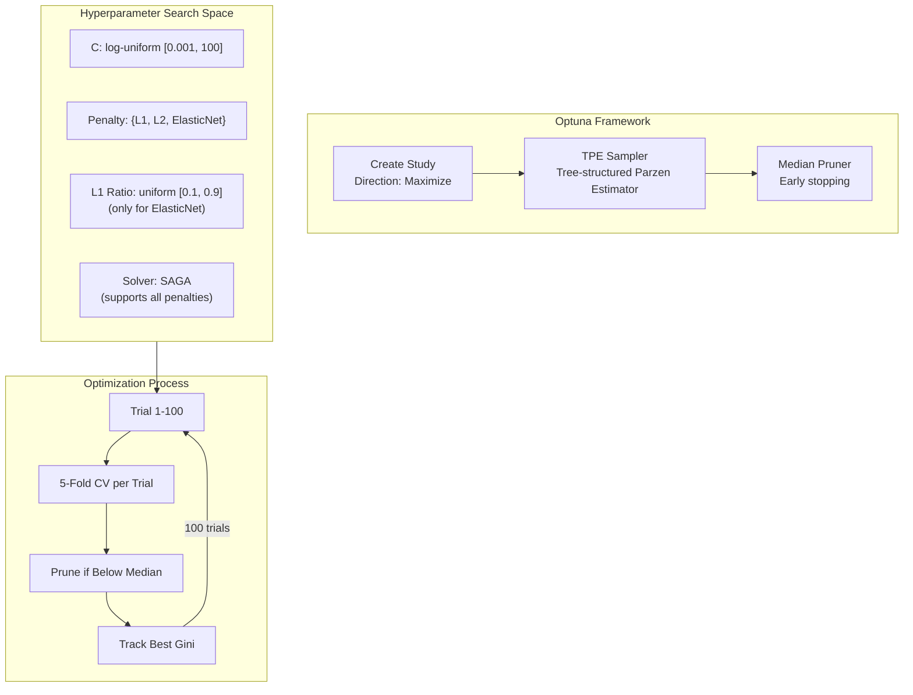
```mermaid
flowchart TD
    subgraph Optuna["Optuna Framework"]
        O1["Create Study<br/>Direction: Maximize"]
        O2["TPE Sampler<br/>Tree-structured Parzen Estimator"]
        O3["Median Pruner<br/>Early stopping"]
    end

    subgraph Search["Hyperparameter Search Space"]
        S1["C: log-uniform [0.001, 100]"]
        S2["Penalty: {L1, L2, ElasticNet}"]
        S3["L1 Ratio: uniform [0.1, 0.9]<br/>(only for ElasticNet)"]
        S4["Solver: SAGA<br/>(supports all penalties)"]
    end

    subgraph Process["Optimization Process"]
        P1["Trial 1-100"]
        P2["5-Fold CV per Trial"]
        P3["Prune if Below Median"]
        P4["Track Best Gini"]
    end

    O1 --> O2 --> O3
    Search --> P1
    P1 --> P2 --> P3 --> P4
    P4 -->|"100 trials"| P1
```

### Trial Execution Flow

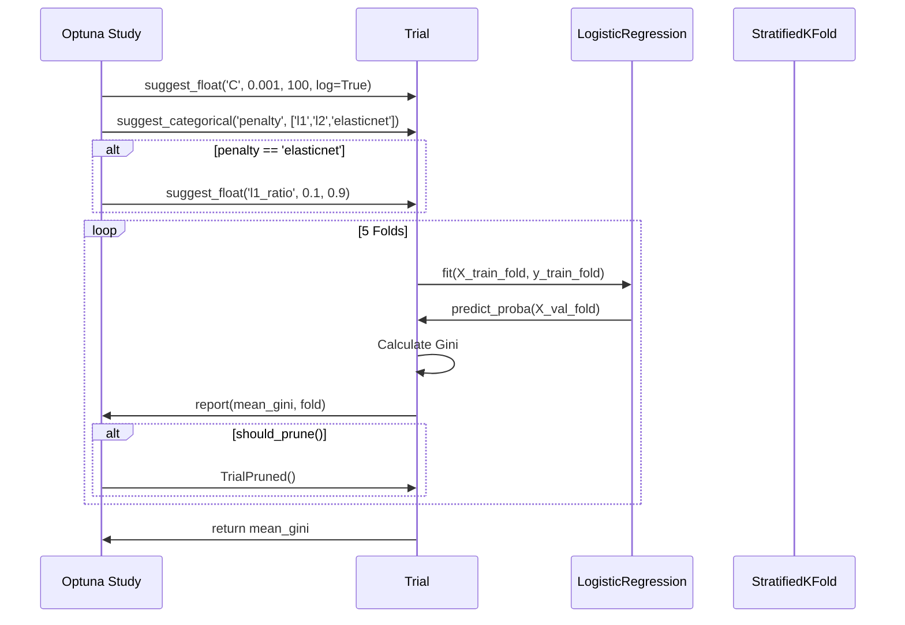
```mermaid
sequenceDiagram
    participant Study as Optuna Study
    participant Trial as Trial
    participant Model as LogisticRegression
    participant CV as StratifiedKFold

    Study->>Trial: suggest_float('C', 0.001, 100, log=True)
    Study->>Trial: suggest_categorical('penalty', ['l1','l2','elasticnet'])

    alt penalty == 'elasticnet'
        Study->>Trial: suggest_float('l1_ratio', 0.1, 0.9)
    end

    loop 5 Folds
        Trial->>Model: fit(X_train_fold, y_train_fold)
        Model->>Trial: predict_proba(X_val_fold)
        Trial->>Trial: Calculate Gini
        Trial->>Study: report(mean_gini, fold)

        alt should_prune()
            Study->>Trial: TrialPruned()
        end
    end

    Trial->>Study: return mean_gini
```

### Regularization Comparison

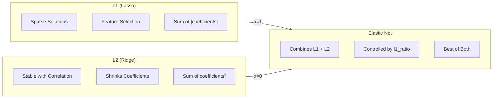
```mermaid
flowchart LR
    subgraph L1["L1 (Lasso)"]
        L1A["Sparse Solutions"]
        L1B["Feature Selection"]
        L1C["Sum of |coefficients|"]
    end

    subgraph L2["L2 (Ridge)"]
        L2A["Stable with Correlation"]
        L2B["Shrinks Coefficients"]
        L2C["Sum of coefficients²"]
    end

    subgraph EN["Elastic Net"]
        ENA["Combines L1 + L2"]
        ENB["Controlled by l1_ratio"]
        ENC["Best of Both"]
    end

    L1 --> |"α=1"| EN
    L2 --> |"α=0"| EN
```

---

## Evaluation Metrics

### Primary Metrics

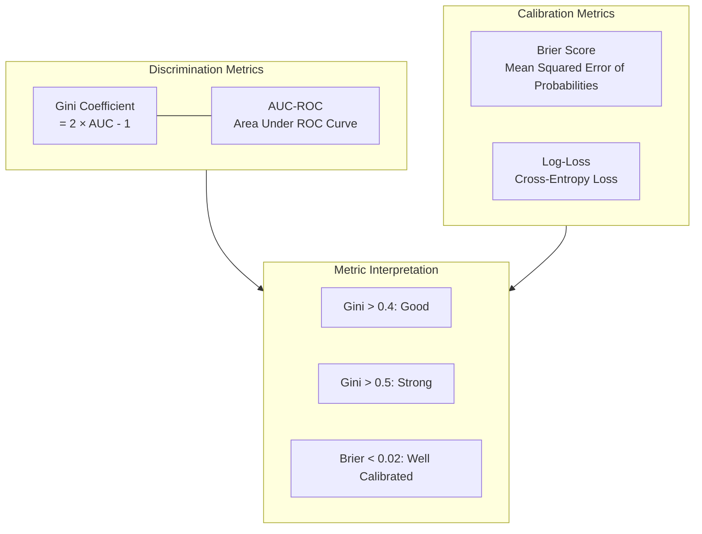
```mermaid
flowchart TD
    subgraph Discrimination["Discrimination Metrics"]
        G["Gini Coefficient<br/>= 2 × AUC - 1"]
        A["AUC-ROC<br/>Area Under ROC Curve"]
        G --- A
    end

    subgraph Calibration["Calibration Metrics"]
        B["Brier Score<br/>Mean Squared Error of Probabilities"]
        L["Log-Loss<br/>Cross-Entropy Loss"]
    end

    subgraph Interpretation["Metric Interpretation"]
        I1["Gini > 0.4: Good"]
        I2["Gini > 0.5: Strong"]
        I3["Brier < 0.02: Well Calibrated"]
    end

    Discrimination --> Interpretation
    Calibration --> Interpretation
```

### Metric Formulas

| Metric | Formula | Range | Optimal |
|--------|---------|-------|---------|
| **Gini** | 2 × AUC - 1 | [-1, 1] | Higher is better |
| **AUC-ROC** | Area under TPR vs FPR curve | [0, 1] | Higher is better |
| **Brier Score** | (1/n) × Σ(p_i - y_i)² | [0, 1] | Lower is better |
| **Log-Loss** | -(1/n) × Σ[y×log(p) + (1-y)×log(1-p)] | [0, ∞) | Lower is better |

### Model Performance Comparison

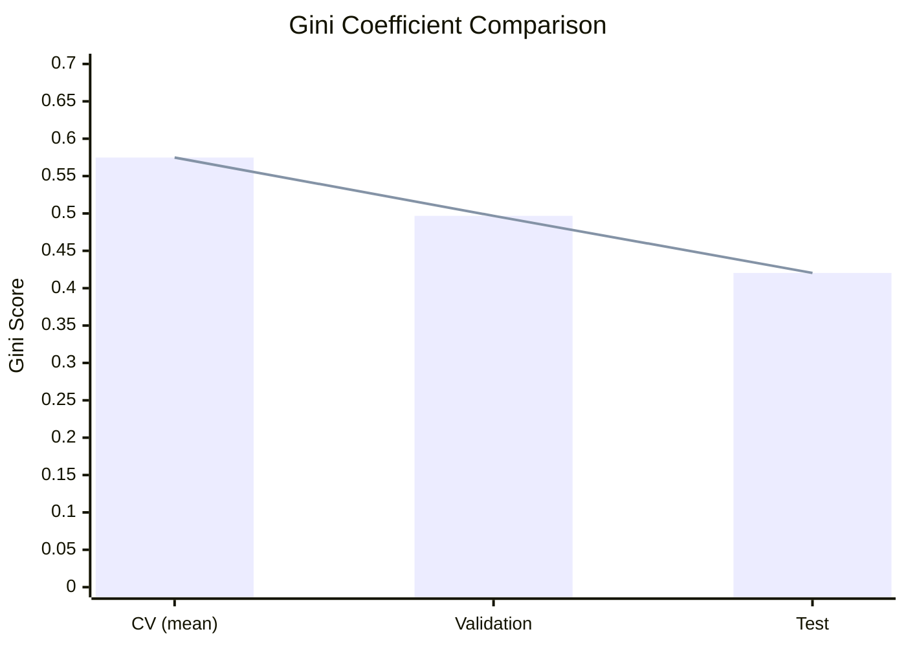
```mermaid
xychart-beta
    title "Gini Coefficient Comparison"
    x-axis ["CV (mean)", "Validation", "Test"]
    y-axis "Gini Score" 0 --> 0.7
    bar [0.5748, 0.4968, 0.4204]
    line [0.5748, 0.4968, 0.4204]
```

### Performance Summary Table

| Dataset | Baseline AUC | Baseline Gini | Optimized AUC | Optimized Gini |
|---------|--------------|---------------|---------------|----------------|
| CV (mean) | 0.7874 | 0.5748 | TBD* | TBD* |
| Validation | 0.7484 | 0.4968 | TBD* | TBD* |
| Test | 0.7102 | 0.4204 | TBD* | TBD* |

*Results depend on optimization run

---

## Validation Strategy

### Data Split Architecture

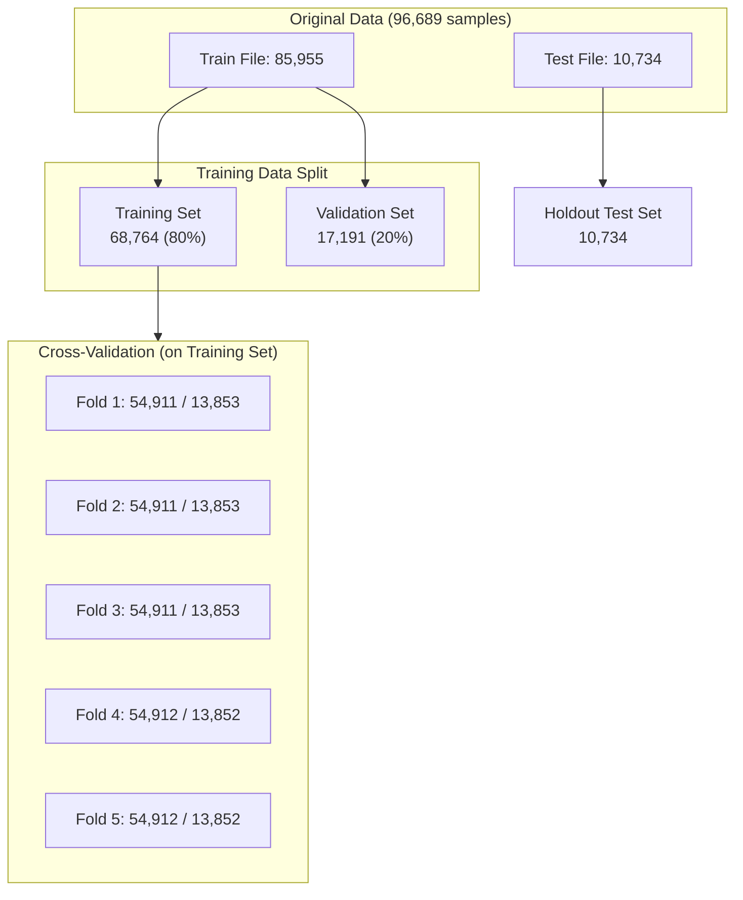
```mermaid
flowchart TD
    subgraph Original["Original Data (96,689 samples)"]
        O1["Train File: 85,955"]
        O2["Test File: 10,734"]
    end

    subgraph TrainSplit["Training Data Split"]
        T1["Training Set<br/>68,764 (80%)"]
        T2["Validation Set<br/>17,191 (20%)"]
    end

    subgraph CVSplit["Cross-Validation (on Training Set)"]
        CV1["Fold 1: 54,911 / 13,853"]
        CV2["Fold 2: 54,911 / 13,853"]
        CV3["Fold 3: 54,911 / 13,853"]
        CV4["Fold 4: 54,912 / 13,852"]
        CV5["Fold 5: 54,912 / 13,852"]
    end

    O1 --> T1 & T2
    O2 --> Holdout["Holdout Test Set<br/>10,734"]
    T1 --> CVSplit
```

### Overfitting Detection

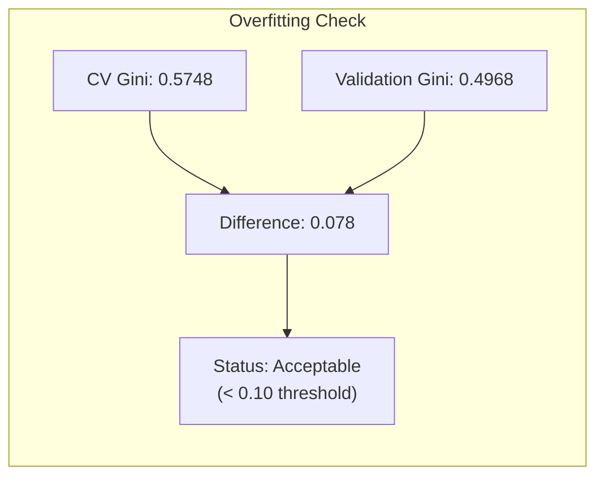
```mermaid
flowchart LR
    subgraph Check["Overfitting Check"]
        C1["CV Gini: 0.5748"]
        C2["Validation Gini: 0.4968"]
        C3["Difference: 0.078"]
        C4["Status: Acceptable<br/>(< 0.10 threshold)"]
    end

    C1 --> C3
    C2 --> C3
    C3 --> C4
```

### Stratification Importance

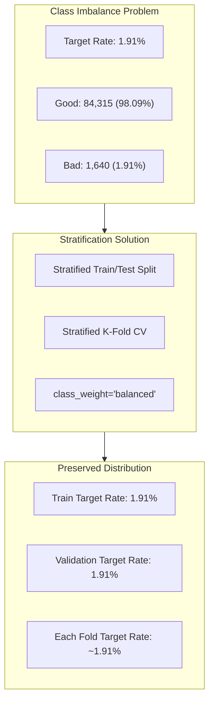
```mermaid
flowchart TD
    subgraph Problem["Class Imbalance Problem"]
        P1["Target Rate: 1.91%"]
        P2["Good: 84,315 (98.09%)"]
        P3["Bad: 1,640 (1.91%)"]
    end

    subgraph Solution["Stratification Solution"]
        S1["Stratified Train/Test Split"]
        S2["Stratified K-Fold CV"]
        S3["class_weight='balanced'"]
    end

    subgraph Result["Preserved Distribution"]
        R1["Train Target Rate: 1.91%"]
        R2["Validation Target Rate: 1.91%"]
        R3["Each Fold Target Rate: ~1.91%"]
    end

    Problem --> Solution --> Result
```

---

## Output Artifacts

### File Structure

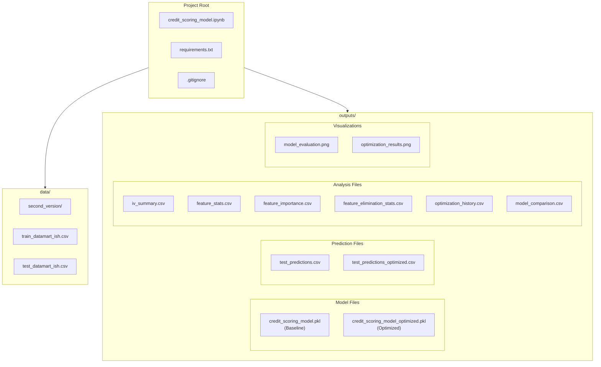
```mermaid
flowchart TD
    subgraph Project["Project Root"]
        N["credit_scoring_model.ipynb"]
        R["requirements.txt"]
        G[".gitignore"]
    end

    subgraph Data["data/"]
        D1["second_version/"]
        D2["train_datamart_ish.csv"]
        D3["test_datamart_ish.csv"]
    end

    subgraph Outputs["outputs/"]
        subgraph Models["Model Files"]
            M1["credit_scoring_model.pkl<br/>(Baseline)"]
            M2["credit_scoring_model_optimized.pkl<br/>(Optimized)"]
        end

        subgraph Predictions["Prediction Files"]
            P1["test_predictions.csv"]
            P2["test_predictions_optimized.csv"]
        end

        subgraph Analysis["Analysis Files"]
            A1["iv_summary.csv"]
            A2["feature_stats.csv"]
            A3["feature_importance.csv"]
            A4["feature_elimination_stats.csv"]
            A5["optimization_history.csv"]
            A6["model_comparison.csv"]
        end

        subgraph Visuals["Visualizations"]
            V1["model_evaluation.png"]
            V2["optimization_results.png"]
        end
    end

    Project --> Data
    Project --> Outputs
```

### Model Artifact Contents

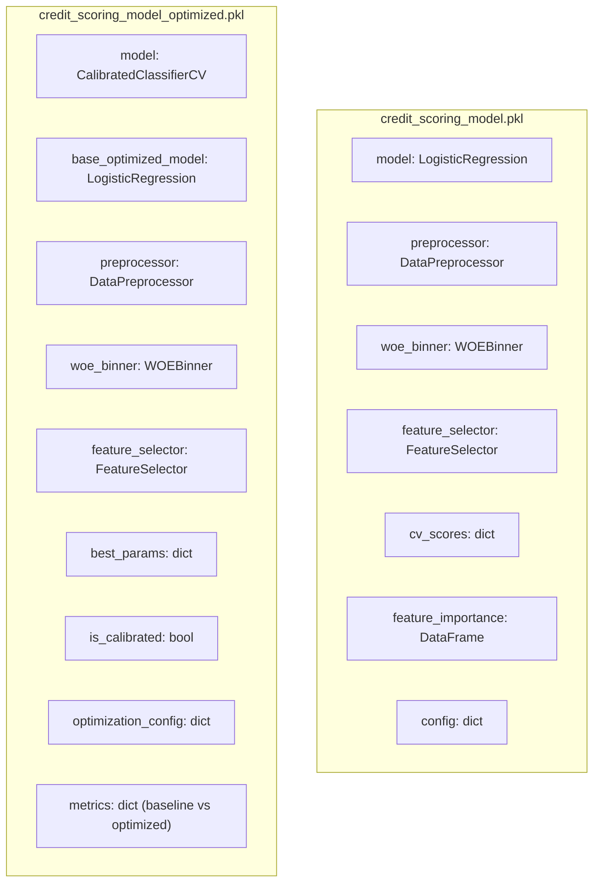
```mermaid
flowchart TD
    subgraph Baseline["credit_scoring_model.pkl"]
        B1["model: LogisticRegression"]
        B2["preprocessor: DataPreprocessor"]
        B3["woe_binner: WOEBinner"]
        B4["feature_selector: FeatureSelector"]
        B5["cv_scores: dict"]
        B6["feature_importance: DataFrame"]
        B7["config: dict"]
    end

    subgraph Optimized["credit_scoring_model_optimized.pkl"]
        O1["model: CalibratedClassifierCV"]
        O2["base_optimized_model: LogisticRegression"]
        O3["preprocessor: DataPreprocessor"]
        O4["woe_binner: WOEBinner"]
        O5["feature_selector: FeatureSelector"]
        O6["best_params: dict"]
        O7["is_calibrated: bool"]
        O8["optimization_config: dict"]
        O9["metrics: dict (baseline vs optimized)"]
    end
```

---

## Installation

### Requirements

```
pandas>=2.2.0
numpy>=2.0.0
scikit-learn>=1.5.0
matplotlib>=3.9.0
seaborn>=0.13.2
jupyter>=1.0.0
notebook>=7.0.0
optuna>=3.5.0
```

### Setup

```bash
# Clone or navigate to project
cd scoring

# Create virtual environment
python -m venv .venv

# Activate environment
# Windows:
.venv\Scripts\activate
# Linux/Mac:
source .venv/bin/activate

# Install dependencies
pip install -r requirements.txt
```

---

## Usage

### Running the Pipeline

1. **Open Jupyter Notebook**
   ```bash
   jupyter notebook credit_scoring_model.ipynb
   ```

2. **Execute All Cells**
   - Run cells sequentially
   - Optimization section takes ~20 minutes

3. **Review Outputs**
   - Check `outputs/` directory for results
   - Compare baseline vs optimized in `model_comparison.csv`

### Loading Saved Model

```python
import pickle

# Load optimized model
with open('outputs/credit_scoring_model_optimized.pkl', 'rb') as f:
    artifacts = pickle.load(f)

model = artifacts['model']
preprocessor = artifacts['preprocessor']
woe_binner = artifacts['woe_binner']
feature_selector = artifacts['feature_selector']

# Make predictions on new data
def predict(new_data):
    # Preprocess
    cleaned = preprocessor.transform(new_data)
    # WOE transform
    woe_features = woe_binner.transform(cleaned)
    # Select features
    selected = feature_selector.transform(woe_features)
    # Fill nulls
    final = selected.fillna(0)
    # Predict
    return model.predict_proba(final)[:, 1]
```

---

## Top Predictive Features

| Rank | Feature | Coefficient | Description |
|------|---------|-------------|-------------|
| 1 | ALL_OSMTOB_183D365D | +1.2235 | Outstanding amount (183-365 days) |
| 2 | OL_OACMXLMT_365D | +1.1955 | Max credit limit (365 days) |
| 3 | CCOL_OSMLMT_182D_O | +1.1644 | Outstanding limit (182 days) |
| 4 | CCOL_BNK_LMTUSGHIGH80P_EVER | +1.0531 | Bank limit usage >80% ever |
| 5 | CCOL_OCNT_12MWPS_0_365DP | -1.0290 | Count behavior (protective) |

---

## License

This project is proprietary. All rights reserved.

---

## Version History

| Version | Date | Changes |
|---------|------|---------|
| 1.0 | 2024 | Initial WOE + Logistic Regression pipeline |
| 2.0 | 2024 | Added Optuna hyperparameter optimization |
| 2.1 | 2024 | Added isotonic probability calibration |
