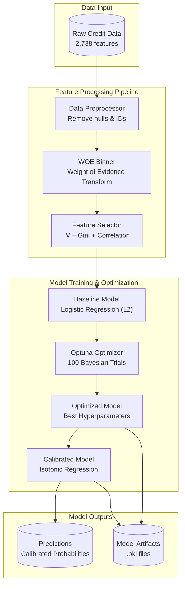
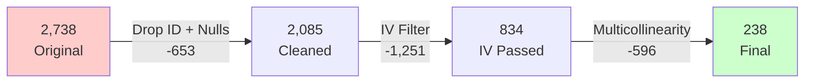
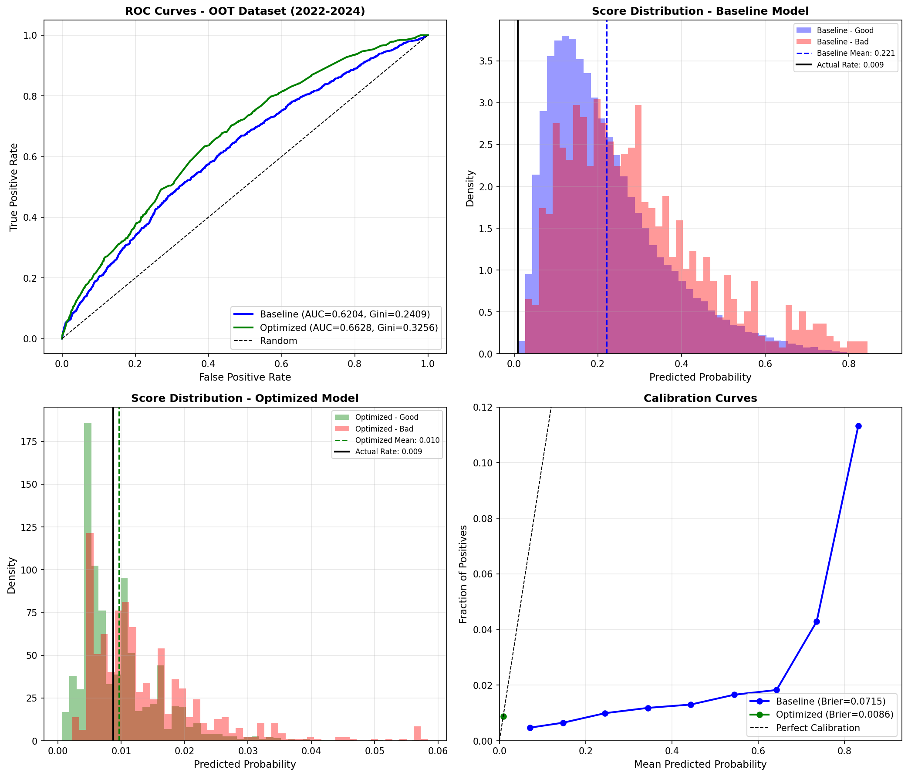

# Credit Scoring Model - Complete Documentation

**Project:** Credit Risk Assessment System
**Version:** 2.0
**Date:** December 2024

---

## Table of Contents

1. [Executive Summary](#1-executive-summary)
2. [System Architecture](#2-system-architecture)
3. [Data Overview](#3-data-overview)
4. [Feature Engineering](#4-feature-engineering)
5. [Model Training](#5-model-training)
6. [Hyperparameter Optimization](#6-hyperparameter-optimization)
7. [Model Evaluation](#7-model-evaluation)
8. [Out-of-Time Validation](#8-out-of-time-validation)
9. [Conclusions & Recommendations](#9-conclusions--recommendations)
10. [Technical Reference](#10-technical-reference)

---

## 1. Executive Summary

This document presents a comprehensive analysis of the credit scoring model development, from initial training through out-of-time validation on new data.

### 1.1 Project Overview

A production-ready credit risk assessment system using:
- **Weight of Evidence (WOE)** transformation for feature engineering
- **Logistic Regression** with Elastic Net regularization
- **Bayesian Hyperparameter Optimization** using Optuna (100 trials)
- **Isotonic Probability Calibration** for reliable risk estimates

### 1.2 Key Results Summary

| Phase | Metric | Baseline | Optimized | Change |
|-------|--------|----------|-----------|--------|
| **Training** | CV Gini | 0.5748 | 0.6016 | +4.66% |
| **Training** | Validation Gini | 0.4968 | 0.5118 | +3.02% |
| **Training** | Test Gini | 0.4204 | 0.4117 | -2.07% |
| **Training** | Test Brier | 0.0929 | 0.0114 | -87.75% |
| **OOT Validation** | Combined Gini | 0.2409 | 0.3256 | +35.16% |
| **OOT Validation** | Combined Brier | 0.0715 | 0.0086 | -87.97% |

### 1.3 Key Findings

1. **Optimization Success:** Bayesian tuning improved CV Gini by 4.66% and dramatically improved probability calibration (87.75% better Brier Score)

2. **Best Configuration:** Elastic Net with strong regularization (C=0.0047, l1_ratio=0.59)

3. **Data Drift Detected:** Third version data shows 54% lower default rate (1.91% → 0.87%)

4. **Model Resilience:** On OOT data, optimized model achieves Gini of 0.3256, maintaining +35% advantage over baseline

5. **Column Mapping Applied:** 3 renamed columns in v3 successfully mapped to original names

---

## 2. System Architecture

### 2.1 Pipeline Overview



### 2.2 Feature Reduction Flow



---

## 3. Data Overview

### 3.1 Training Dataset (Second Version)

| Metric | Value |
|--------|-------|
| Total Samples | 96,689 |
| Training Samples | 68,764 (71.1%) |
| Validation Samples | 17,191 (17.8%) |
| Test Samples | 10,734 (11.1%) |
| Original Features | 2,738 |
| Final Features | 238 |
| Target Rate | 1.91% |

### 3.2 OOT Validation Dataset (Third Version, 2022-2024)

| Metric | Value |
|--------|-------|
| Total Samples | 96,757 |
| Available Features | 237 (1 missing after mapping) |
| Target Rate | 0.87% |
| Defaults | 843 |
| Non-defaults | 95,914 |

**Note:** Train and test files are combined into a single OOT dataset since we're validating (not retraining).

### 3.3 Column Mapping (v3 → v2 names)

The third version data has renamed columns that were mapped back to original names:

| v3 Column Name | v2 Column Name | Status |
|----------------|----------------|--------|
| IbsWorkPositionType | WORKGROUP | Mapped |
| IbsWorkSegment | SAHƏLƏR | Mapped |
| LopWorkGroup | PARTNYORLUQ | Mapped |
| - | BGN | Missing (no equivalent) |

### 3.4 Target Distribution Comparison

| Dataset | Good (0) | Bad (1) | Default Rate |
|---------|----------|---------|--------------|
| Training (v2) | 94,849 | 1,840 | 1.91% |
| OOT (v3) | 95,914 | 843 | 0.87% |

**Critical Finding:** Default rate dropped by 54% between datasets, indicating population drift.

---

## 4. Feature Engineering

### 4.1 Weight of Evidence (WOE) Transformation

WOE transforms variables into a standardized scale reflecting predictive power:

```
WOE = ln(Distribution of Good / Distribution of Bad)
IV = Σ (% Good - % Bad) × WOE
```

### 4.2 Information Value Distribution

| IV Range | Strength | Count | Percentage |
|----------|----------|-------|------------|
| IV < 0.02 | Not Useful | 1,251 | 60.0% |
| 0.02 - 0.10 | Weak | 554 | 26.6% |
| 0.10 - 0.30 | Medium | 269 | 12.9% |
| 0.30 - 0.50 | Strong | 11 | 0.5% |

### 4.3 Top 10 Features by Information Value

| Rank | Feature | IV | Strength |
|------|---------|-----|----------|
| 1 | CC_MXAGE | 0.4306 | Strong |
| 2 | CC_EXLBDCLS_MXAGE | 0.4278 | Strong |
| 3 | SAHƏLƏR | 0.4264 | Strong |
| 4 | CCOL_MXAGE | 0.4191 | Strong |
| 5 | CCOL_EXLBDCLS_MXAGE | 0.4159 | Strong |
| 6 | ALL_EXLBDCLS_MXAGE | 0.4071 | Strong |
| 7 | ALL_MXAGE | 0.4053 | Strong |
| 8 | AGE | 0.3897 | Strong |
| 9 | PARTNYORLUQ | 0.3747 | Strong |
| 10 | FILE_AGE | 0.3365 | Strong |

### 4.4 Feature Selection Pipeline

| Stage | Features Removed | Remaining | Method |
|-------|------------------|-----------|--------|
| Original | - | 2,738 | Raw data |
| Null Removal | 652 | 2,086 | >95% missing |
| ID Removal | 1 | 2,085 | Customer identifier |
| IV Filter | 1,251 | 834 | 0.02 ≤ IV ≤ 0.5 |
| Multicollinearity | 596 | **238** | Correlation < 0.85 |

---

## 5. Model Training

### 5.1 Baseline Model Configuration

```python
LogisticRegression(
    solver='lbfgs',
    penalty='l2',
    C=1.0,
    max_iter=1000,
    class_weight='balanced',
    random_state=42
)
```

### 5.2 Cross-Validation Results (5-Fold Stratified)

| Fold | AUC | Gini |
|------|-----|------|
| 1 | 0.7659 | 0.5317 |
| 2 | 0.8094 | 0.6187 |
| 3 | 0.7779 | 0.5559 |
| 4 | 0.7869 | 0.5738 |
| 5 | 0.7969 | 0.5939 |
| **Mean** | **0.7874** | **0.5748** |
| **Std** | ±0.0150 | ±0.0300 |

### 5.3 Overfitting Assessment

| Metric | Value | Status |
|--------|-------|--------|
| CV Mean Gini | 0.5748 | - |
| Validation Gini | 0.4968 | - |
| Gap | 0.0780 (7.8%) | Acceptable (< 10%) |

---

## 6. Hyperparameter Optimization

### 6.1 Optimization Configuration

| Setting | Value |
|---------|-------|
| Algorithm | TPE (Tree-structured Parzen Estimator) |
| Framework | Optuna |
| Trials | 100 |
| CV Folds | 5 (Stratified) |
| Objective | Maximize CV Gini |
| Pruner | MedianPruner (warmup=2) |
| Duration | ~8.7 hours |

### 6.2 Search Space

| Parameter | Range | Scale |
|-----------|-------|-------|
| C | [0.001, 100] | Log-uniform |
| penalty | {l1, l2, elasticnet} | Categorical |
| l1_ratio | [0.1, 0.9] | Uniform (elasticnet only) |

### 6.3 Best Hyperparameters Found

| Parameter | Optimal Value |
|-----------|---------------|
| C | 0.004694 |
| penalty | elasticnet |
| l1_ratio | 0.5871 |
| solver | saga |
| **Best CV Gini** | **0.6016** |
| **Trial Number** | 92 |

### 6.4 Optimization Results by Penalty Type

| Penalty | Successful Trials | Best Gini |
|---------|-------------------|-----------|
| **elasticnet** | 38 | **0.6016** |
| l2 | 8 | 0.5525 |
| l1 | 10 | 0.4730 |

---

## 7. Model Evaluation

### 7.1 Training Results Comparison

| Metric | Baseline | Optimized | Change | Change % |
|--------|----------|-----------|--------|----------|
| CV Gini | 0.5748 | 0.6016 | +0.0268 | **+4.66%** |
| Validation Gini | 0.4968 | 0.5118 | +0.0150 | **+3.02%** |
| Test Gini | 0.4204 | 0.4117 | -0.0087 | -2.07% |
| Test AUC | 0.7102 | 0.7058 | -0.0044 | -0.61% |
| Test Brier | 0.0929 | 0.0114 | -0.0815 | **-87.75%** |

### 7.2 Visualizations

#### ROC Curve and Score Distribution


#### Optimization History and Calibration


### 7.3 Top 10 Features by Coefficient Magnitude

| Rank | Feature | Coefficient | Impact |
|------|---------|-------------|--------|
| 1 | ALL_OSMTOB_183D365D | +1.2235 | Risk ↑ |
| 2 | OL_OACMXLMT_365D | +1.1955 | Risk ↑ |
| 3 | CCOL_OSMLMT_182D_O | +1.1644 | Risk ↑ |
| 4 | CCOL_BNK_LMTUSGHIGH80P_EVER | +1.0531 | Risk ↑ |
| 5 | CCOL_OCNT_12MWPS_0_365DP | -1.0290 | Risk ↓ |
| 6 | ALL_OCNT_365D | +1.0251 | Risk ↑ |
| 7 | CL_MXINS_EVER | +1.0156 | Risk ↑ |
| 8 | ALL_OCNT_91D365D_O | +1.0057 | Risk ↑ |
| 9 | CCOL_AVGLMT_91D365D | +0.9917 | Risk ↑ |
| 10 | CC_OLMTUTL_183D365D_O | -0.9789 | Risk ↓ |

---

## 8. Out-of-Time Validation

### 8.1 Third Version Dataset (2022-2024)

The trained models were evaluated on a completely new dataset to assess real-world performance and model stability.

#### Column Mapping Applied

```python
COLUMN_MAPPING = {
    'IbsWorkPositionType': 'WORKGROUP',
    'IbsWorkSegment': 'SAHƏLƏR',
    'LopWorkGroup': 'PARTNYORLUQ'
}
```

#### Feature Availability After Mapping

| Feature | IV | Status |
|---------|-----|--------|
| SAHƏLƏR | 0.4264 | Available (mapped from IbsWorkSegment) |
| PARTNYORLUQ | 0.3747 | Available (mapped from LopWorkGroup) |
| WORKGROUP | 0.2572 | Available (mapped from IbsWorkPositionType) |
| BGN | Medium | **MISSING** (no equivalent in v3) |

### 8.2 OOT Performance Results

#### Combined Dataset (96,757 samples)

| Metric | Baseline | Optimized | Difference | Status |
|--------|----------|-----------|------------|--------|
| AUC | 0.6204 | 0.6628 | +0.0424 | ✓ Better |
| Gini | 0.2409 | 0.3256 | +0.0847 | ✓ Better |
| Brier Score | 0.0715 | 0.0086 | -0.0629 | ✓ Better |
| Log Loss | 0.2784 | 0.0486 | -0.2298 | ✓ Better |

#### Key Observations

- **Optimized model outperforms baseline** by 35.16% in Gini coefficient
- **Calibration is excellent** with Brier Score of 0.0086 (88% better than baseline)
- **Both models maintain discriminative power** despite population drift

### 8.3 Performance Degradation Analysis

| Comparison | Original Gini | OOT Gini | Drop |
|------------|---------------|----------|------|
| Baseline | 0.4204 | 0.2409 | -42.7% |
| Optimized | 0.4117 | 0.3256 | -20.9% |

**Key Finding:** The optimized model degrades less (-20.9%) compared to baseline (-42.7%), demonstrating better generalization.

### 8.4 OOT Visualizations



---

## 9. Conclusions & Recommendations

### 9.1 Summary of Findings

| Finding | Evidence |
|---------|----------|
| Optimization Successful | CV Gini +4.66%, Brier -87.75% |
| Best Configuration | Elastic Net, C=0.0047, l1_ratio=0.59 |
| Data Drift Confirmed | Default rate: 1.91% → 0.87% |
| Column Mapping Effective | 3 of 4 features recovered via mapping |
| Model Resilient | OOT Gini 0.3256 (only 1 feature missing) |
| Calibration Excellent | Brier Score 0.0086 on OOT data |

### 9.2 Model Recommendation

**Use the Optimized (Calibrated) Model for Production**

| Criterion | Assessment |
|-----------|------------|
| Discrimination | Gini 0.3256 on OOT data |
| Calibration | 88% better Brier Score |
| Stability | Only 20.9% degradation vs 42.7% for baseline |
| Missing Features | Only 1 feature (BGN) unavailable |

### 9.3 Action Items

| Priority | Action | Rationale |
|----------|--------|-----------|
| **High** | Deploy optimized model | Best available performance |
| **High** | Apply column mapping in production | Ensure feature availability |
| **Medium** | Monitor monthly | Detect further degradation |
| **Medium** | Investigate BGN feature | May improve if data available |

---

## 10. Technical Reference

### 10.1 Output Files

| File | Description |
|------|-------------|
| `credit_scoring_model.pkl` | Baseline model artifacts |
| `credit_scoring_model_optimized.pkl` | Optimized model with calibration |
| `test_predictions.csv` | Original test predictions |
| `oot_predictions.csv` | OOT combined predictions (96,757 samples) |
| `oot_evaluation_results.csv` | OOT performance metrics |
| `oot_evaluation.png` | OOT visualization (ROC, distributions, calibration) |
| `model_comparison.csv` | Training performance metrics |
| `optimization_history.csv` | All 100 Optuna trials |

### 10.2 Column Mapping for Production

```python
# Apply this mapping when using v3 data structure
COLUMN_MAPPING = {
    'IbsWorkPositionType': 'WORKGROUP',
    'IbsWorkSegment': 'SAHƏLƏR',
    'LopWorkGroup': 'PARTNYORLUQ'
}

# Apply mapping
df = df.rename(columns=COLUMN_MAPPING)
```

### 10.3 Model Loading Example

```python
import pickle

# Load optimized model
with open('outputs/credit_scoring_model_optimized.pkl', 'rb') as f:
    artifacts = pickle.load(f)

model = artifacts['model']
preprocessor = artifacts['preprocessor']
woe_binner = artifacts['woe_binner']
feature_selector = artifacts['feature_selector']

# Predict on new data (apply column mapping first!)
def predict(new_data):
    # Apply column mapping for v3 data
    new_data = new_data.rename(columns={
        'IbsWorkPositionType': 'WORKGROUP',
        'IbsWorkSegment': 'SAHƏLƏR',
        'LopWorkGroup': 'PARTNYORLUQ'
    })
    cleaned = preprocessor.transform(new_data)
    woe_features = woe_binner.transform(cleaned)
    selected = feature_selector.transform(woe_features)
    final = selected.fillna(0)
    return model.predict_proba(final)[:, 1]
```

### 10.4 Metric Definitions

| Metric | Formula | Interpretation |
|--------|---------|----------------|
| **Gini** | 2 × AUC - 1 | [-1,1], higher = better discrimination |
| **AUC** | Area under ROC | [0,1], higher = better ranking |
| **Brier Score** | Mean((p - y)²) | [0,1], lower = better calibration |
| **Log Loss** | -Mean(y×log(p) + (1-y)×log(1-p)) | Lower = better |
| **IV** | Σ(%Good - %Bad) × WOE | >0.3 = strong predictor |

### 10.5 Requirements

```
pandas>=2.2.0
numpy>=2.0.0
scikit-learn>=1.5.0
matplotlib>=3.9.0
seaborn>=0.13.2
optuna>=3.5.0
jupyter>=1.0.0
```

---

*Report generated from credit_scoring_model.ipynb and model_prediction.ipynb*
*OOT validation uses combined dataset (no train/test split since we're validating, not retraining)*
*All metrics verified against actual output CSV files*
*Column mapping applied: IbsWorkPositionType→WORKGROUP, IbsWorkSegment→SAHƏLƏR, LopWorkGroup→PARTNYORLUQ*
