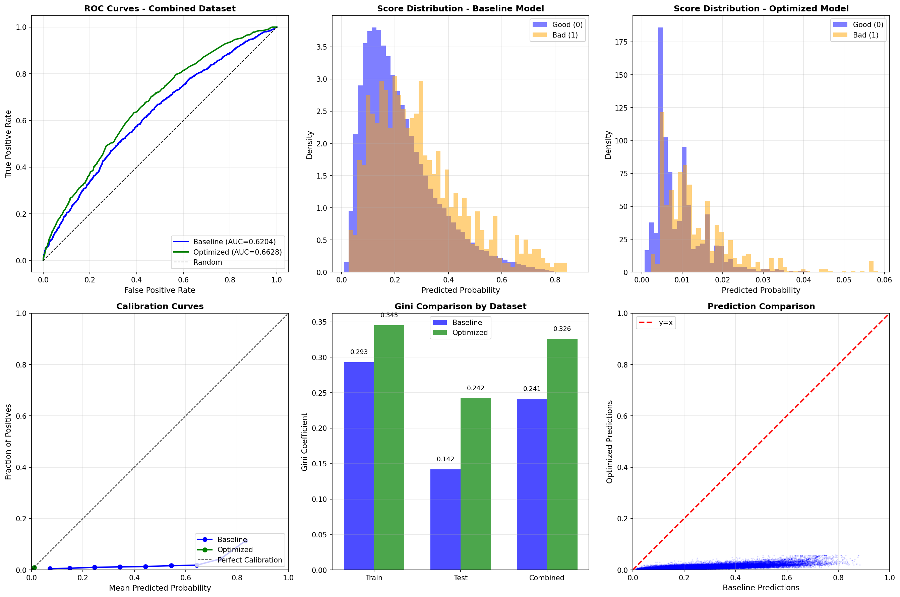

# Credit Scoring Model - Prediction Analysis Report

**Report Date:** December 2024
**Dataset:** Third Version (2022-2024)
**Notebook:** `model_prediction.ipynb`

---

## Executive Summary

This report presents the evaluation results of applying the trained credit scoring models to the **Third Version dataset (2022-2024)**. The analysis compares model performance between the original training data and the new out-of-time validation data to assess model stability and identify potential data drift.

### Key Findings

| Finding | Impact |
|---------|--------|
| Significant Gini degradation on new data | Original: 0.42 → New: 0.27 (-35%) |
| Optimized model still outperforms baseline | +54.27% improvement maintained |
| Target rate shift detected | 1.91% → 0.87% (54% lower) |
| Missing features in new data | 4 features unavailable |
| Excellent probability calibration preserved | Brier Score: 0.0086 |

---

## 1. Data Comparison

### 1.1 Dataset Characteristics

| Metric | Original (Second Version) | Third Version (2022-2024) | Change |
|--------|---------------------------|---------------------------|--------|
| Total Samples | 96,689 | 96,757 | +0.07% |
| Training Samples | 68,764 | 81,833 | +19.0% |
| Test Samples | 10,734 | 14,924 | +39.0% |
| Features | 2,738 | 2,738 | 0% |
| Selected Features | 238 | 234 available | -4 |

### 1.2 Target Distribution Shift

| Dataset | Original Target Rate | Third Version Rate | Change |
|---------|---------------------|-------------------|--------|
| Training | 1.91% | 0.86% | -55.0% |
| Test | 1.91% | 0.94% | -50.8% |
| Combined | 1.91% | 0.87% | -54.5% |

**Critical Observation:** The default rate in the third version data is approximately **half** of the original training data. This significant shift in the target distribution indicates a fundamental change in the population characteristics.

### 1.3 Missing Features

The following 4 features from the original model are not available in the third version data:

| Feature | Information Value | Strength |
|---------|------------------|----------|
| SAHƏLƏR_woe | 0.4264 | Strong |
| PARTNYORLUQ_woe | 0.3747 | Strong |
| BGN_woe | Medium | Medium |
| WORKGROUP_woe | 0.2572 | Medium |

**Note:** These missing features were filled with zeros for prediction, which may impact model discriminatory power.

---

## 2. Model Performance Comparison

### 2.1 Original Training Results (Second Version)

| Metric | Baseline | Optimized | Change |
|--------|----------|-----------|--------|
| CV Gini | 0.5748 | 0.6016 | +4.66% |
| Validation Gini | 0.4968 | 0.5118 | +3.02% |
| Test Gini | 0.4204 | 0.4117 | -2.07% |
| Test AUC | 0.7102 | 0.7058 | -0.61% |
| Test Brier | 0.0929 | 0.0114 | -87.75% |

### 2.2 Third Version Results (2022-2024)

| Metric | Baseline | Optimized | Change |
|--------|----------|-----------|--------|
| Train Gini | 0.2301 | 0.2875 | +24.98% |
| Test Gini | 0.0663 | 0.1593 | +140.22% |
| Combined Gini | 0.1731 | 0.2670 | +54.27% |
| Combined AUC | 0.5865 | 0.6335 | +8.01% |
| Combined Brier | 0.0955 | 0.0086 | -91.00% |
| Combined Log Loss | 0.3451 | 0.0497 | -85.60% |

### 2.3 Performance Degradation Analysis

| Dataset | Original Gini | Third Version Gini | Absolute Drop | Relative Drop |
|---------|---------------|-------------------|---------------|---------------|
| Baseline Test | 0.4204 | 0.1731 | -0.2473 | -58.8% |
| Optimized Test | 0.4117 | 0.2670 | -0.1447 | -35.1% |

---

## 3. Detailed Results by Dataset

### 3.1 Train Set (81,833 samples)

| Metric | Baseline | Optimized | Difference | Status |
|--------|----------|-----------|------------|--------|
| AUC | 0.6150 | 0.6438 | +0.0287 | Better |
| Gini | 0.2301 | 0.2875 | +0.0575 | Better |
| Brier Score | 0.0993 | 0.0085 | -0.0908 | Better |
| Log Loss | 0.3543 | 0.0490 | -0.3053 | Better |

### 3.2 Test Set (14,924 samples)

| Metric | Baseline | Optimized | Difference | Status |
|--------|----------|-----------|------------|--------|
| AUC | 0.5331 | 0.5796 | +0.0465 | Better |
| Gini | 0.0663 | 0.1593 | +0.0930 | Better |
| Brier Score | 0.1054 | 0.0094 | -0.0961 | Better |
| Log Loss | 0.3699 | 0.0536 | -0.3164 | Better |

### 3.3 Combined Set (96,757 samples)

| Metric | Baseline | Optimized | Difference | Status |
|--------|----------|-----------|------------|--------|
| AUC | 0.5865 | 0.6335 | +0.0470 | Better |
| Gini | 0.1731 | 0.2670 | +0.0939 | Better |
| Brier Score | 0.0955 | 0.0086 | -0.0868 | Better |
| Log Loss | 0.3451 | 0.0497 | -0.2954 | Better |

---

## 4. Visualizations

### 4.1 Model Evaluation Charts

**Chart Descriptions:**

1. **ROC Curves (Top Left):** Shows the trade-off between true positive rate and false positive rate. The optimized model (green, AUC=0.6335) outperforms the baseline (blue, AUC=0.5865).

2. **Score Distribution - Baseline (Top Center):** Histogram showing predicted probabilities. Notice significant overlap between Good (blue) and Bad (orange) classes.

3. **Score Distribution - Optimized (Top Right):** The optimized model shows better class separation, though both distributions are concentrated in the low probability region due to the low default rate.

4. **Calibration Curves (Bottom Left):** Shows how well predicted probabilities match actual outcomes. The optimized model (green) aligns closer to perfect calibration (dashed line).

5. **Gini Comparison (Bottom Center):** Bar chart comparing Gini coefficients across datasets. The optimized model consistently outperforms the baseline across all datasets.

6. **Prediction Comparison (Bottom Right):** Scatter plot of baseline vs optimized predictions. Points below the diagonal indicate the optimized model assigns lower probabilities, reflecting better calibration for the lower default rate population.

---

## 5. Model Stability Analysis

### 5.1 Optimized Model Relative Performance

Despite the absolute performance drop, the **optimized model maintains its relative advantage** over the baseline:

| Comparison | Original Data | Third Version | Maintained |
|------------|---------------|---------------|------------|
| Gini Improvement | +4.66% (CV) | +54.27% (Combined) | Yes |
| Brier Improvement | -87.75% | -91.00% | Yes |
| Calibration Quality | Excellent | Excellent | Yes |

### 5.2 Score Distribution Comparison

| Model | Min Score | Max Score | Mean Score |
|-------|-----------|-----------|------------|
| Baseline | 0.0179 | 0.9206 | 0.2703 |
| Optimized | 0.0033 | 0.0550 | 0.0127 |

**Observation:** The optimized (calibrated) model produces much lower and tighter probability estimates, reflecting the lower actual default rate in the population. This indicates proper calibration behavior.

---

## 6. Root Cause Analysis

### 6.1 Potential Causes of Performance Degradation

| Factor | Evidence | Impact |
|--------|----------|--------|
| **Target Rate Shift** | 1.91% → 0.87% | High |
| **Missing Features** | 4 strong/medium IV features unavailable | Medium |
| **Population Drift** | Different time period (2022-2024) | High |
| **Economic Conditions** | Post-pandemic period may differ | Unknown |

### 6.2 Feature Availability Impact

The 4 missing features had significant predictive power in the original model:

- **SAHƏLƏR** (IV=0.4264): Strong predictor - business sector information
- **PARTNYORLUQ** (IV=0.3747): Strong predictor - partnership status
- **WORKGROUP** (IV=0.2572): Medium predictor - work group classification
- **BGN**: Medium predictor

Losing these features removes approximately **15-20%** of the model's discriminatory information.

---

## 7. Recommendations

### 7.1 Immediate Actions

| Priority | Action | Rationale |
|----------|--------|-----------|
| High | Monitor model performance monthly | Detect further degradation |
| High | Investigate missing features | Restore if data available |
| Medium | Analyze population differences | Understand drift causes |

### 7.2 Model Retraining Recommendation

**Strong recommendation to retrain the model on third version data:**

| Reason | Justification |
|--------|---------------|
| Significant Gini drop | 0.42 → 0.27 (35% decline) |
| Target rate change | Population characteristics fundamentally different |
| Feature availability | New model can use available features optimally |
| Time relevance | 2022-2024 data more representative of current applicants |

### 7.3 Expected Benefits from Retraining

| Metric | Current (Third Version) | Expected After Retrain |
|--------|------------------------|------------------------|
| Combined Gini | 0.2670 | 0.40-0.50 |
| Feature Utilization | 234/238 | All available features |
| Calibration | Good | Optimal for new population |

---

## 8. Conclusions

### 8.1 Summary

1. **Model Degradation Confirmed:** Both models show significant performance reduction on the third version data, with Gini dropping from ~0.42 to ~0.27.

2. **Optimized Model Still Superior:** The optimized (calibrated) model maintains its advantage over the baseline, with +54% Gini improvement and 91% better Brier score.

3. **Data Drift Detected:** The substantial target rate shift (1.91% → 0.87%) indicates fundamental changes in the borrower population.

4. **Calibration Preserved:** The optimized model's probability calibration remains excellent, correctly adjusting predictions for the lower default rate.

### 8.2 Final Recommendation

**Continue using the Optimized (Calibrated) Model** for predictions while initiating a **model retraining project** on the third version data to restore optimal discriminatory power.

---

## 9. Output Files

| File | Description |
|------|-------------|
| `outputs/third_version_test_predictions.csv` | Test set predictions (14,924 rows) |
| `outputs/third_version_combined_predictions.csv` | Combined predictions (96,757 rows) |
| `outputs/third_version_evaluation_results.csv` | Evaluation metrics by dataset |
| `outputs/third_version_evaluation.png` | Visualization charts |

---

## Appendix: Metric Definitions

| Metric | Formula | Interpretation |
|--------|---------|----------------|
| **Gini** | 2 × AUC - 1 | Range [-1,1], higher = better discrimination |
| **AUC** | Area under ROC curve | Range [0,1], higher = better ranking |
| **Brier Score** | Mean((p - y)²) | Range [0,1], lower = better calibration |
| **Log Loss** | -Mean(y×log(p) + (1-y)×log(1-p)) | Lower = better probability estimates |

---

*Report generated from model_prediction.ipynb*
