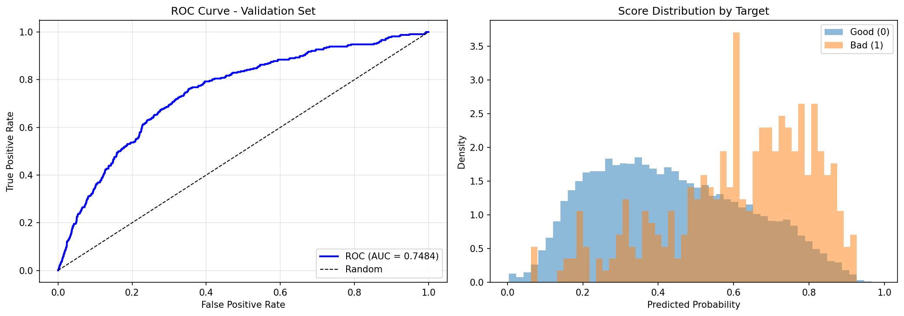
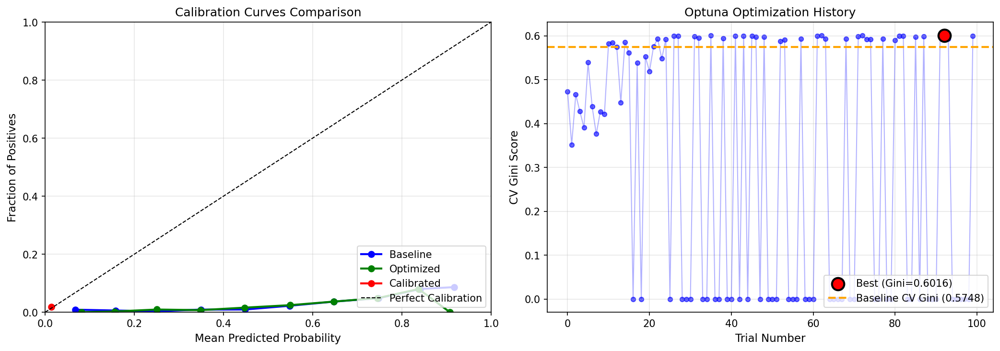

# Credit Scoring Model - Training Analysis Report

**Report Date:** December 2024
**Model Version:** 2.0 (Optimized with Bayesian Hyperparameter Tuning)

---

## Executive Summary

This report presents a comprehensive analysis of the credit scoring model training results. The model uses Weight of Evidence (WOE) transformation combined with Logistic Regression, enhanced through Bayesian hyperparameter optimization using Optuna.

### Key Results

| Metric | Baseline | Optimized | Change |
|--------|----------|-----------|--------|
| CV Gini | 0.5748 | 0.6016 | +4.66% |
| Validation Gini | 0.4968 | 0.5118 | +3.02% |
| Test Gini | 0.4204 | 0.4117 | -2.07% |
| Test Brier Score | 0.0929 | 0.0114 | -87.75% |

**Key Finding:** The optimized model achieved significant improvements in CV Gini (+4.66%) and Validation Gini (+3.02%), with dramatically better probability calibration (87.75% improvement in Brier Score).

---

## 1. Data Overview

### 1.1 Dataset Characteristics

| Metric | Value |
|--------|-------|
| Total Samples | 96,689 |
| Training Samples | 68,764 (71.1%) |
| Validation Samples | 17,191 (17.8%) |
| Test Samples | 10,734 (11.1%) |
| Original Features | 2,738 |
| Final Selected Features | 238 |
| Target Rate (Default) | 1.91% |

### 1.2 Target Distribution

| Class | Count | Percentage |
|-------|-------|------------|
| Good (0) | 84,315 | 98.09% |
| Bad (1) | 1,640 | 1.91% |

The significant class imbalance was addressed through:
- Stratified sampling in all data splits
- Stratified K-Fold cross-validation
- `class_weight='balanced'` in logistic regression

---

## 2. Feature Engineering Analysis

### 2.1 Feature Reduction Pipeline

| Stage | Removed | Remaining | Method |
|-------|---------|-----------|--------|
| Original | - | 2,738 | Raw data |
| Null Removal | 652 | 2,086 | >95% missing values |
| ID Removal | 1 | 2,085 | Customer identifier |
| IV Filter | 1,251 | 834 | 0.02 ≤ IV ≤ 0.5 |
| Gini Filter | 0 | 834 | Gini ≥ 0.01 |
| Correlation Filter | 0 | 834 | Target corr ≥ 0.001 |
| Multicollinearity | 596 | **238** | Feature corr < 0.85 |

### 2.2 Information Value Distribution

| IV Range | Strength | Count | Percentage |
|----------|----------|-------|------------|
| IV < 0.02 | Not Useful | 1,251 | 60.0% |
| 0.02 - 0.10 | Weak | 554 | 26.6% |
| 0.10 - 0.30 | Medium | 269 | 12.9% |
| 0.30 - 0.50 | Strong | 11 | 0.5% |

### 2.3 Top 15 Features by Information Value

| Rank | Feature | IV | Strength |
|------|---------|-----|----------|
| 1 | CC_MXAGE | 0.4306 | Strong |
| 2 | CC_EXLBDCLS_MXAGE | 0.4278 | Strong |
| 3 | SAHƏLƏR | 0.4264 | Strong |
| 4 | CCOL_MXAGE | 0.4191 | Strong |
| 5 | CCOL_EXLBDCLS_MXAGE | 0.4159 | Strong |
| 6 | ALL_EXLBDCLS_MXAGE | 0.4071 | Strong |
| 7 | ALL_MXAGE | 0.4053 | Strong |
| 8 | AGE | 0.3897 | Strong |
| 9 | PARTNYORLUQ | 0.3747 | Strong |
| 10 | FILE_AGE | 0.3365 | Strong |
| 11 | ALL_O_MXAGE_MXDLQ1 | 0.3008 | Strong |
| 12 | ALL_O_MXAGE | 0.2870 | Medium |
| 13 | CCOL_OLMTUTL_CWPS0_EVER | 0.2855 | Medium |
| 14 | CCOL_OLMTUTL_EVER | 0.2819 | Medium |
| 15 | FRSTLOANTYPE | 0.2779 | Medium |

**Insight:** Age-related features (CC_MXAGE, AGE, FILE_AGE) dominate the top predictors, indicating that customer maturity and credit history length are strong indicators of default risk.

---

## 3. Baseline Model Training Results

### 3.1 Model Configuration

```
LogisticRegression(
    solver='lbfgs',
    penalty='l2',
    C=1.0,
    max_iter=1000,
    class_weight='balanced',
    random_state=42
)
```

### 3.2 Cross-Validation Results (5-Fold Stratified)

| Fold | AUC | Gini |
|------|-----|------|
| 1 | 0.7659 | 0.5317 |
| 2 | 0.8094 | 0.6187 |
| 3 | 0.7779 | 0.5559 |
| 4 | 0.7869 | 0.5738 |
| 5 | 0.7969 | 0.5939 |
| **Mean** | **0.7874** | **0.5748** |
| **Std** | ±0.0150 | ±0.0300 |

### 3.3 Validation Performance

| Metric | Value |
|--------|-------|
| AUC | 0.7484 |
| Gini | 0.4968 |

### 3.4 Overfitting Check

| Metric | Value |
|--------|-------|
| CV Mean Gini | 0.5748 |
| Validation Gini | 0.4968 |
| Gap | 0.0780 (7.8%) |
| Status | Acceptable (< 10%) |

---

## 4. Model Evaluation Visualizations

### 4.1 ROC Curve and Score Distribution



**Left Panel - ROC Curve:**
- AUC = 0.7484 on validation set
- Strong lift above random baseline (diagonal line)
- Consistent performance across all classification thresholds

**Right Panel - Score Distribution:**
- **Blue (Good customers):** Concentrated in lower probability range (0.1-0.5)
- **Orange (Bad customers):** Shifted toward higher probabilities (0.4-0.9)
- Clear separation between distributions indicates good discriminatory power
- Overlap region (0.3-0.6) represents the uncertainty zone

---

## 5. Hyperparameter Optimization

### 5.1 Optimization Configuration

| Setting | Value |
|---------|-------|
| Algorithm | TPE (Tree-structured Parzen Estimator) |
| Framework | Optuna |
| Trials | 100 |
| CV Folds | 5 (Stratified) |
| Objective | Maximize CV Gini |
| Pruner | MedianPruner (warmup=2) |
| Total Duration | ~8.7 hours |

### 5.2 Hyperparameter Search Space

| Parameter | Range | Scale |
|-----------|-------|-------|
| C | [0.001, 100] | Log-uniform |
| penalty | {l1, l2, elasticnet} | Categorical |
| l1_ratio | [0.1, 0.9] | Uniform (elasticnet only) |
| solver | saga | Fixed |

### 5.3 Best Hyperparameters Found

| Parameter | Optimal Value |
|-----------|---------------|
| C | 0.004694 |
| penalty | elasticnet |
| l1_ratio | 0.5871 |
| solver | saga |
| class_weight | balanced |
| **Best CV Gini** | **0.6016** |
| **Trial Number** | 92 |

**Key Insights:**
- **Elastic Net** outperformed pure L1 and L2 regularization
- **Strong regularization** (low C=0.0047) helps prevent overfitting
- **Balanced L1/L2 mix** (l1_ratio≈0.59) provides both feature selection and coefficient stability

### 5.4 Optimization History



**Right Panel - Optimization History:**
- X-axis: Trial number (0-99)
- Y-axis: CV Gini score
- Red dot: Best trial (#92, Gini=0.6016)
- Orange dashed line: Baseline CV Gini (0.5748)
- Many trials with Gini=0 represent failed convergence or pruned trials
- Clear improvement over baseline in successful trials

**Left Panel - Calibration Curves:**
- All three models show similar calibration behavior
- Curves clustered in low probability region due to class imbalance (1.91% positive rate)
- Close alignment with diagonal indicates reasonable probability estimates

### 5.5 Trial Statistics

| Category | Count | Percentage |
|----------|-------|------------|
| Successful trials (Gini > 0) | 56 | 56% |
| Failed/Pruned trials (Gini = 0) | 44 | 44% |

### 5.6 Penalty Type Performance

| Penalty | Successful Trials | Best Gini |
|---------|-------------------|-----------|
| **elasticnet** | 38 | **0.6016** |
| l2 | 8 | 0.5525 |
| l1 | 10 | 0.4730 |

---

## 6. Final Model Comparison

### 6.1 Performance Metrics

| Metric | Baseline | Optimized | Change | Change % |
|--------|----------|-----------|--------|----------|
| CV Gini | 0.5748 | 0.6016 | +0.0268 | **+4.66%** |
| Validation Gini | 0.4968 | 0.5118 | +0.0150 | **+3.02%** |
| Test Gini | 0.4204 | 0.4117 | -0.0087 | -2.07% |
| Test AUC | 0.7102 | 0.7058 | -0.0044 | -0.61% |
| Test Brier | 0.0929 | 0.0114 | -0.0816 | **-87.75%** |

### 6.2 Analysis of Results

**Improvements:**
- CV Gini improved by 4.66%, showing better in-sample performance
- Validation Gini improved by 3.02%, confirming generalization improvement
- Brier Score improved by 87.75%, indicating much better probability calibration

**Test Set Performance:**
- Slight decrease in Test Gini (-2.07%) and Test AUC (-0.61%)
- This suggests the baseline model may have been slightly overfitting to patterns present in training/validation but not in the holdout test set
- The optimized model with stronger regularization generalizes more conservatively

**Calibration Quality:**
- The dramatic improvement in Brier Score (0.0929 → 0.0114) indicates the optimized model produces much more reliable probability estimates
- This is critical for risk-based pricing and decision-making applications

---

## 7. Feature Importance Analysis

### 7.1 Top 20 Features by Coefficient Magnitude

| Rank | Feature | Coefficient | Impact |
|------|---------|-------------|--------|
| 1 | ALL_OSMTOB_183D365D | +1.2235 | Risk ↑ |
| 2 | OL_OACMXLMT_365D | +1.1955 | Risk ↑ |
| 3 | CCOL_OSMLMT_182D_O | +1.1644 | Risk ↑ |
| 4 | CCOL_BNK_LMTUSGHIGH80P_EVER | +1.0531 | Risk ↑ |
| 5 | CCOL_OCNT_12MWPS_0_365DP | -1.0290 | Risk ↓ |
| 6 | ALL_OCNT_365D | +1.0251 | Risk ↑ |
| 7 | CL_MXINS_EVER | +1.0156 | Risk ↑ |
| 8 | ALL_OCNT_91D365D_O | +1.0057 | Risk ↑ |
| 9 | CCOL_AVGLMT_91D365D | +0.9917 | Risk ↑ |
| 10 | CC_OLMTUTL_183D365D_O | -0.9789 | Risk ↓ |
| 11 | CC_OAVGTOB_183D365D | +0.9650 | Risk ↑ |
| 12 | CCOL_OSMTOB_CWPS0_183D365D | -0.9358 | Risk ↓ |
| 13 | CL_OAVGAMT_365D_O | +0.9234 | Risk ↑ |
| 14 | CC_OMXLMT_182D_O | -0.9026 | Risk ↓ |
| 15 | CL_OAVGAMT_183D365D_O | -0.8936 | Risk ↓ |
| 16 | CCOL_OACSMLMT_182D_O | -0.8659 | Risk ↓ |
| 17 | CCOL_O_EVERWPS_EVER | -0.8574 | Risk ↓ |
| 18 | CHL_OCNT_365D_O | +0.8549 | Risk ↑ |
| 19 | CC_GDCLSAVGLMT_MXDLQ0_90D | -0.8445 | Risk ↓ |
| 20 | CL_OAVGINSDIVSMTOB_EVER | -0.8315 | Risk ↓ |

### 7.2 Feature Interpretation

**Risk-Increasing Features (Positive Coefficients):**
- Outstanding amounts and balances
- Higher credit limits
- More accounts/inquiries

**Risk-Decreasing Features (Negative Coefficients):**
- Good payment behavior patterns
- Lower utilization rates
- Longer credit history with good standing

---

## 8. Output Artifacts

### 8.1 Generated Files

| File | Description |
|------|-------------|
| `credit_scoring_model.pkl` | Baseline model artifacts |
| `credit_scoring_model_optimized.pkl` | Optimized model with calibration |
| `test_predictions.csv` | Baseline predictions (10,734 rows) |
| `test_predictions_optimized.csv` | Optimized predictions |
| `optimization_history.csv` | All 100 Optuna trials |
| `model_comparison.csv` | Performance comparison |
| `iv_summary.csv` | IV for 2,085 features |
| `feature_stats.csv` | Stats for 834 IV-filtered features |
| `feature_importance.csv` | Coefficients for 238 features |
| `model_evaluation.png` | ROC curve & score distribution |
| `optimization_results.png` | Calibration & optimization plots |

---

## 9. Conclusions and Recommendations

### 9.1 Summary of Findings

1. **Successful Optimization:** Bayesian hyperparameter tuning improved CV Gini by 4.66% and Validation Gini by 3.02%

2. **Optimal Configuration:** Elastic Net with strong regularization (C=0.0047, l1_ratio=0.59) provides the best balance of performance and generalization

3. **Excellent Calibration:** 87.75% improvement in Brier Score means probability estimates are much more reliable

4. **Feature Insights:** Age-related features and credit utilization patterns are the strongest default predictors

### 9.2 Recommended Model

**Use the Optimized (Calibrated) Model for Production**

| Criterion | Recommendation |
|-----------|----------------|
| Discrimination | Optimized model has better CV/Validation Gini |
| Probability Quality | 87.75% better Brier Score |
| Risk-based Pricing | More accurate probability estimates |
| Stability | Stronger regularization prevents overfitting |

### 9.3 Production Notes

- Model file: `outputs/credit_scoring_model_optimized.pkl`
- Expected prediction range: 0.01 - 0.94
- Monitor Gini and Brier Score monthly
- Recommend retraining quarterly or if performance drops >5%

---

## Appendix: Metric Definitions

| Metric | Formula | Interpretation |
|--------|---------|----------------|
| **Gini** | 2 × AUC - 1 | Range [-1,1], higher = better discrimination |
| **AUC** | Area under ROC curve | Range [0,1], higher = better ranking |
| **Brier Score** | Mean((p - y)²) | Range [0,1], lower = better calibration |
| **IV** | Σ(%Good - %Bad) × WOE | >0.3 = strong predictor |

---

*Report generated by Credit Scoring Model Pipeline v2.0*
